---
## Author
author:
  name: Стрижов Дмитрий Павлович
  degrees: student
  orcid: 0000-0002-0877-7063
  email: 1132236054@rudn.ru
  affiliation:
    - name: Российский университет дружбы народов
      country: Российская Федерация
      postal-code: 117198
      city: Москва
      address: ул. Миклухо-Маклая, д. 6
## Title
title: "Отчет по лабораторной работе №1"
subtitle: "Подготовка стенда"
license: "CC BY"
---

# Цель работы

Цель данной лабораторной работы --- подготовить рабочее пространство для выполнения дальнейших лабораторных работ и программ и приобрести необходимые навыки работы с Julia.

# Задание

- Создать рабочий каталог для всего курса.
- Создать рабочее пространство для программ в рамках лабораторной работы.
- Выполнить все задания по тексту лабораторной работы.
- Установить необходимые пакеты.
- Выполнить предложенный код.
- Преобразовать код в литературный стиль.
- Сгенерировать из литературного кода:
	- чистый код;
	- jupyter notebook;
	- документацию в формате Quarto.
- Выполнить код из jupyter notebook.
- Интегрировать документацию в формате Quarto в отчёт.
- Добавить в код в литературном стиле вычисление для набора параметров.
- Сгенерировать из литературного кода с параметрами:
	- чистый код;
	- jupyter notebook;
	- документацию в формате Quarto.
- Выполнить код из jupyter notebook с параметрами.
- Интегрировать документацию с параметрами в формате Quarto в отчёт..

# Выполнение лабораторной работы
## Создание рабочего каталога курса

Создаем репозитории для дальнейшей настройки каталога ([рис. @fig-001]).

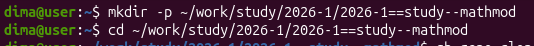{#fig-001 width=70%}

Клонируем проект лабораторной работы из github ([рис. @fig-002]).

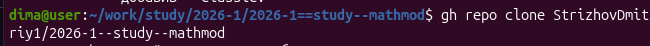{#fig-002 width=70%}

Переходим в нужный каталог ([рис. @fig-003]).

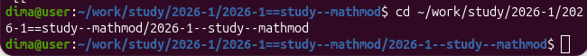{#fig-003 width=70%}

Инициализируем курс ([рис. @fig-004]).

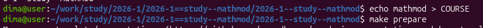{#fig-004 width=70%}

Отправляем файлы на сервер  ([рис. @fig-005, @fig-006]).

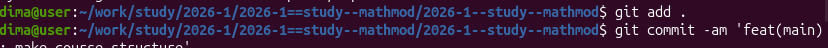{#fig-005 width=70%}

{#fig-006 width=70%}

Инициализируем git-flow ([рис. @fig-007]).

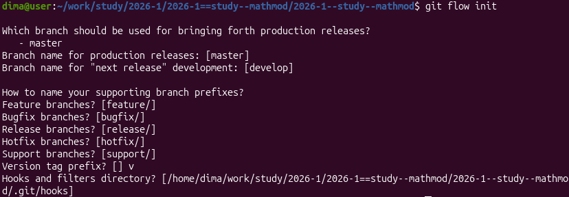{#fig-007 width=70%}

Проверяем на какой ветке мы находимся ([рис. @fig-008]).

{#fig-008 width=70%}

Мы находимся на ветке develop, а значит можем отправить весь проект в хранилице ([рис. @fig-009]).

{#fig-009 width=70%}

Создаем релиз с версией 1.0.0 ([рис. @fig-010]).

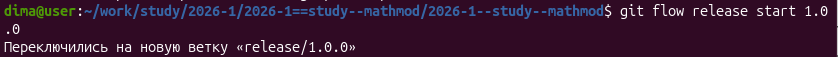{#fig-010 width=70%}

Создаем журнал изменений ([рис. @fig-011]).

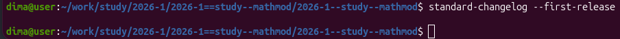{#fig-011 width=70%}

Добавим журнал изменений в индекс ([рис. @fig-012]). 

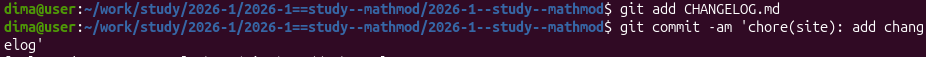{#fig-012 width=70%}

Зальём релизную ветку в основную ветку ([рис. @fig-013]).

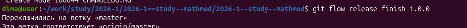{#fig-013 width=70%}

Отправим данные на github ([рис. @fig-014]).

{#fig-014 width=70%}

Скопируем CHANGELOG.md в каталог release ([рис. @fig-015]).

{#fig-015 width=70%}

Создадим релиз ([рис. @fig-016]).

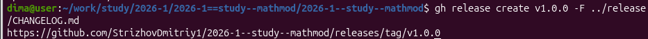{#fig-016 width=70%}

## Установка и настройка необходимых пакетов и ПО

Устанавливаем и/или убеждаемся в наличии пакетов и ПО, необходимых для выполнения лабораторных работ.

	- Средства разработки ([рис. @fig-017]):
	
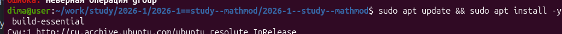{#fig-017 width=70%}

	- Quarto ([рис. @fig-018]):
	
{#fig-018 width=70%}

	- Nodejs, npm, pnpm, yarn ([рис. @fig-019]):
	
{#fig-019 width=70%}	

Настройка Node.js. Для работы с Node.js добавим каталог с исполняемыми файлами, устанавлива-
емыми пакетным менеджером, в переменную PATH ([рис. @fig-020, @fig-021, @fig-022]).

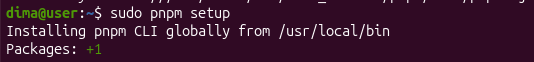{#fig-020 width=70%}	

{#fig-021 width=70%}	

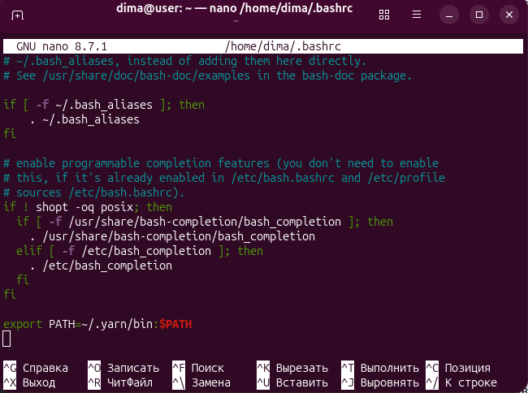{#fig-022 width=70%}	

Устанавливаем git-flow ([рис. @fig-023]).

{#fig-023 width=70%}	

Добавим commitizen ([рис. @fig-024]). 

{#fig-024 width=70%}	

Добавим cz-customizable ([рис. @fig-025]).

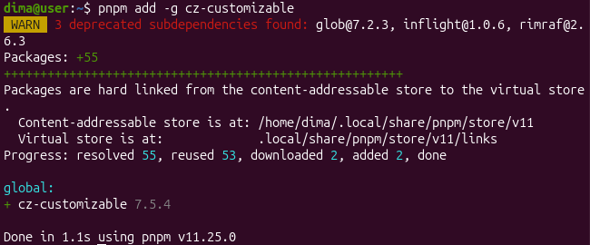{#fig-025 width=70%}	

Добавим standard-version ([рис. @fig-026]).

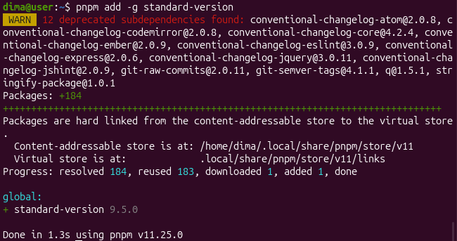{#fig-026 width=70%}	

## Создание проекта DrWatson для лабораторных 

Каталог DrWatson делается в рамках лабораторной работы ([рис. @fig-027]).

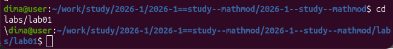{#fig-027 width=70%}	

Создаем каталог DrWatson ([рис. @fig-028, @fig-029]).

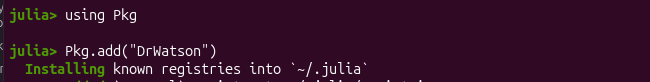{#fig-028 width=70%}	

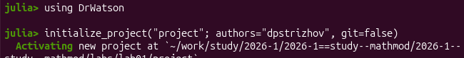{#fig-029 width=70%}	

Видим, что в итоге появился шаблон проекта ([рис. @fig-030]). 

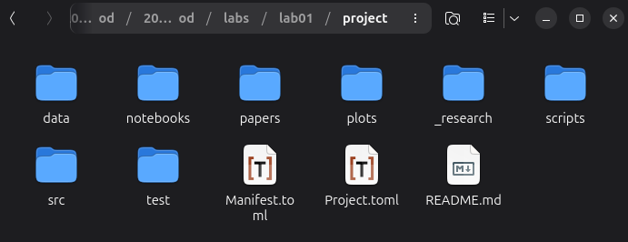{#fig-030 width=70%}	

Добавление необходимых пакетов ([рис. @fig-031]).

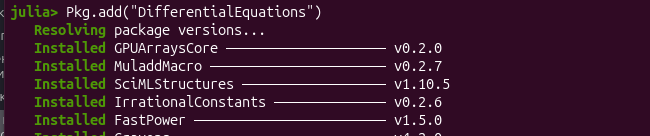{#fig-031 width=70%}	

Прописываем скрипт для проверки наличия всех пакетов ([рис. @fig-032]).

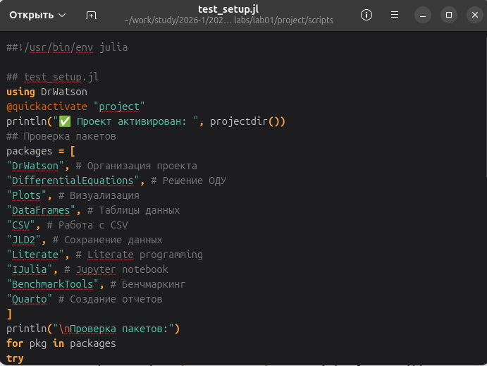{#fig-032 width=70%}	

Как видим на скрине, все необходимые пакеты установились ([рис. @fig-033]).

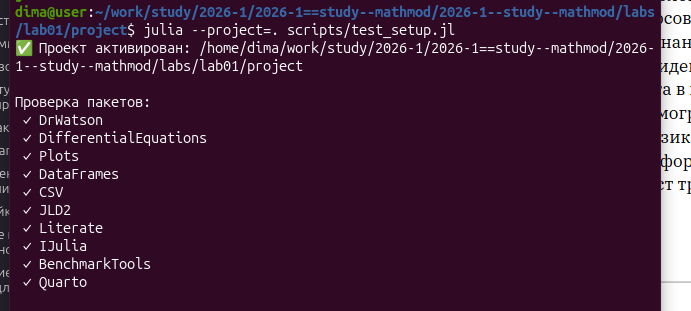{#fig-033 width=70%}	

## Модель экспоненциального роста

В качестве примера выполнения работы используем модель экспоненциального роста.

Экспоненциальный рост — это процесс увеличения величины, при котором скорость роста в каждый момент времени пропорциональна текущему значению этой величины. Чем больше система, тем быстрее она растет. 

Простая аналогия: проценты на проценты в банке или снежный ком, который, катясь, увеличивается тем быстрее, чем больше его размер.

### Реализация модели

Создаём следующий скрипт (scripts/01_exponential_growth.jl) ([рис. @fig-034]).

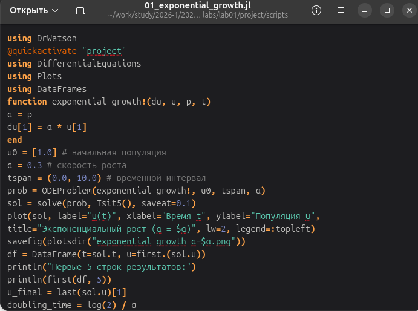{#fig-034 width=70%}

Выполним скрипт ([рис. @fig-035]).

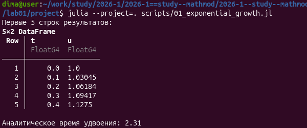{#fig-035 width=70%}

### Литературная реализация модели

Добавим в файл описание в духе литературного программирования ([рис. @fig-036]).

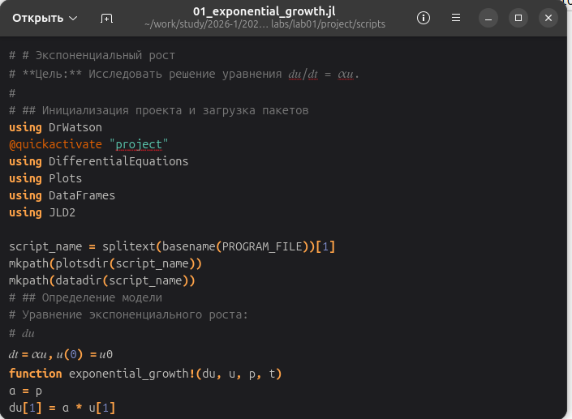{#fig-036 width=70%}

Выполним скрипт ([рис. @fig-037]).

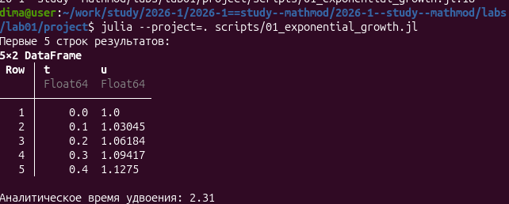{#fig-037 width=70%}

### Создание производных форматов

Создадим скрипт для генерации производных форматов (scripts/tangle.jl) ([рис. @fig-038]).

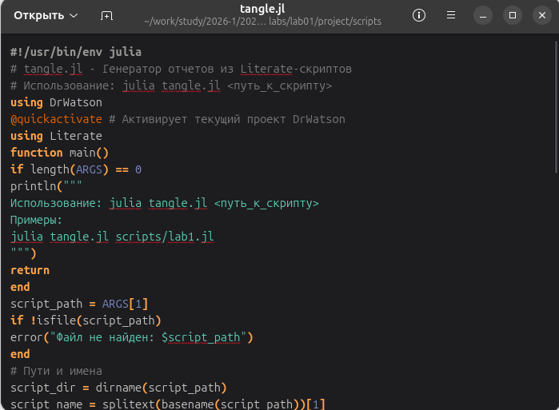{#fig-038 width=70%}

Создадим производные форматы ([рис. @fig-039]).

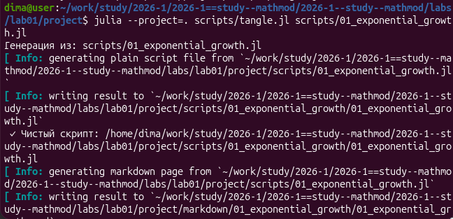{#fig-039 width=70%}

Выполним Jupyter-ноутбук notebooks/01_exponential_growth/01_exponential_growth.ipynb ([рис. @fig-040]).

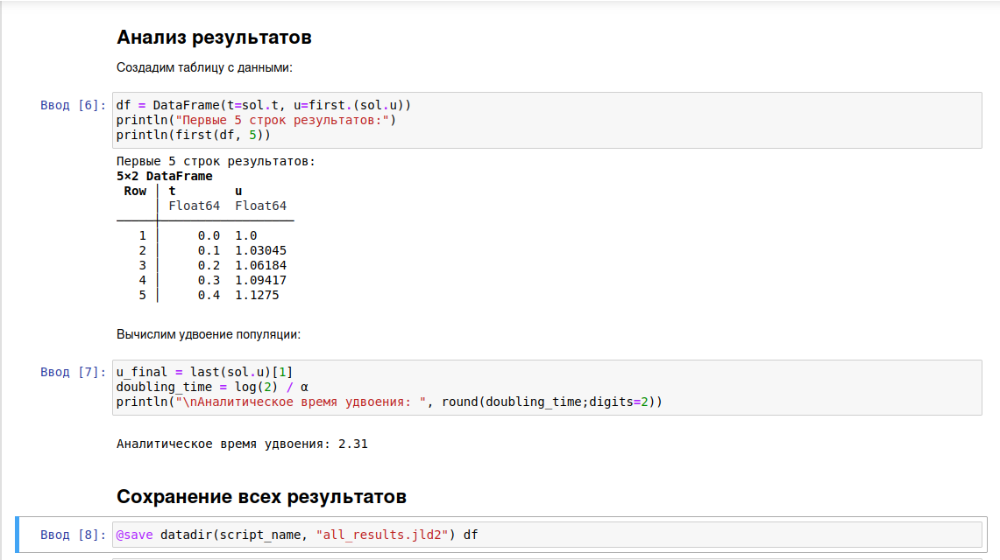{#fig-040 width=70%}

###  Документирование в отчёте

В каталоге отчёта в файл `_quarto.yml` включим поддержку кода julia.

В преамбуле preamble.tex подключим пакет juliamono.

В файле отчёта после описания выполнения лабораторной работы подключим файл описания программы ([рис. @fig-041]).

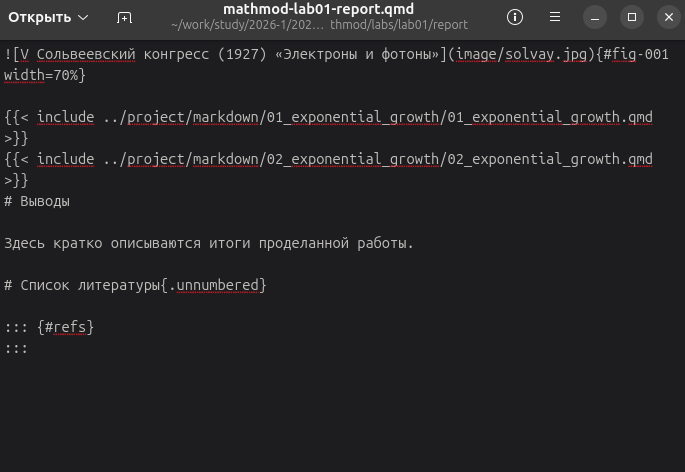{#fig-041 width=70%}

Скомпилируем же наконец отчёт ([рис. @fig-042]).

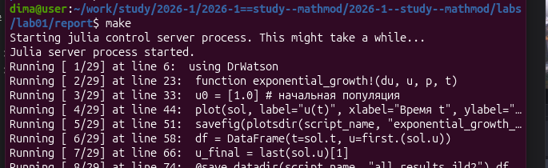{#fig-042 width=70%}

Просмотрим результат ([рис. @fig-043]).

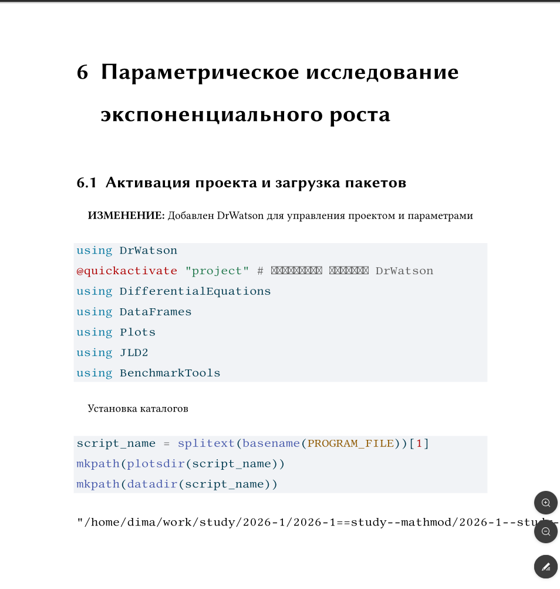{#fig-043 width=70%}

## Реализация модели с параметрами

Изменим программу так, чтобы она принимала набор параметров. Перенесём программу в файл scripts/02_exponential_growth.lj ([рис. @fig-044]).

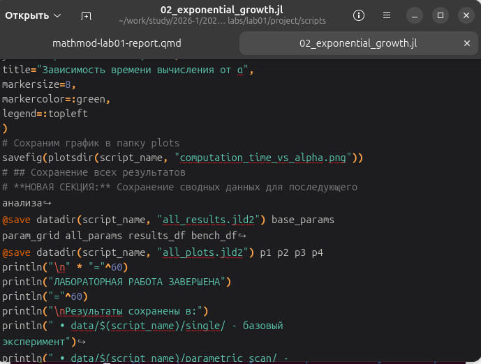{#fig-044 width=70%}

Выполним программу ([рис. @fig-045]).

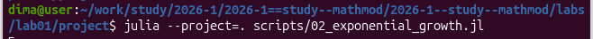{#fig-045 width=70%}

Создадим производные форматы ([рис. @fig-046]).

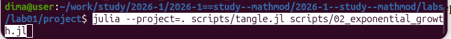{#fig-046 width=70%}

Выполним Jupyter-ноутбук notebooks/02_exponential_growth/02_exponential_growth.ipynb ([рис. @fig-047]).

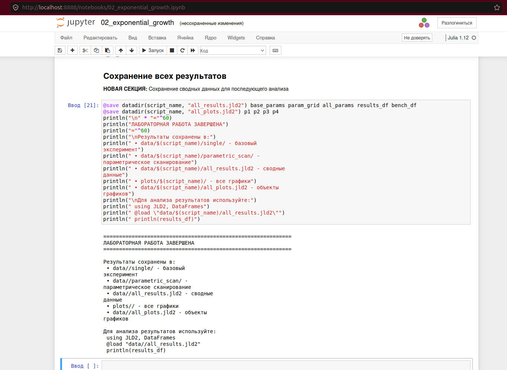{#fig-047 width=70%}

В файле отчёта после описания выполнения лабораторной работы подключим файл описания программы ([рис. @fig-048]).

{#fig-048 width=70%}

Скомпилируем отчёт ([рис. @fig-049]).

{#fig-049 width=70%}





# Выводы

В ходе данной лабораторной работы мной было подготовлено рабочее пространство для выполнения программ и приобретены необходимые навыки создания и преобразования программ на Julia.
