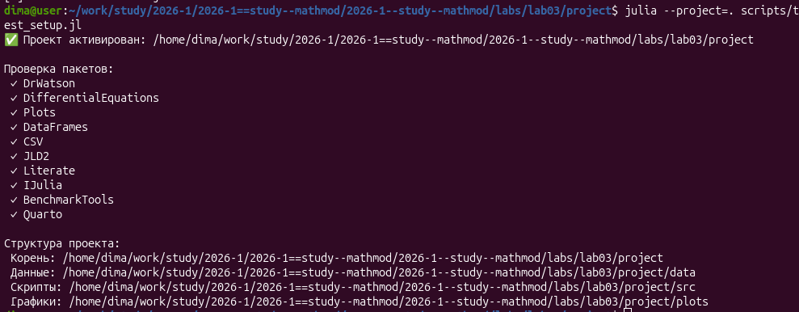
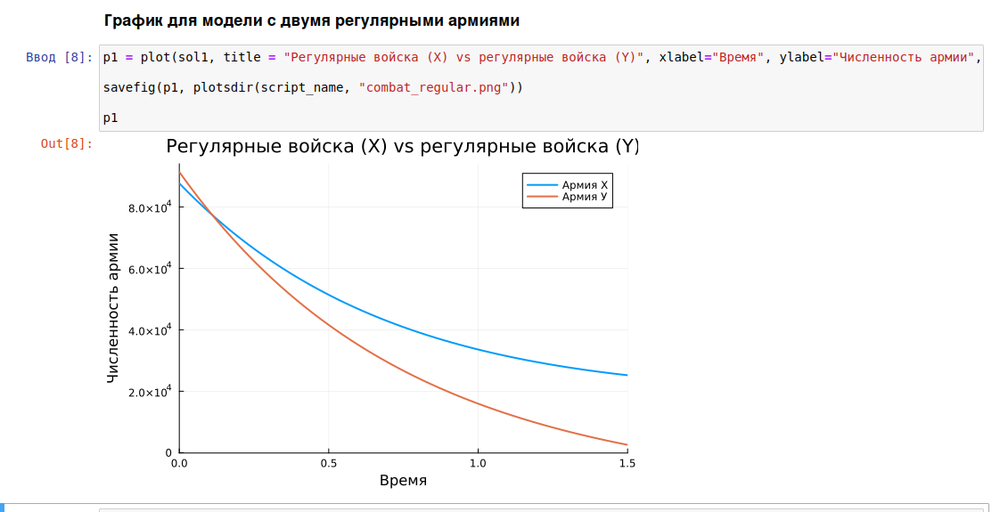
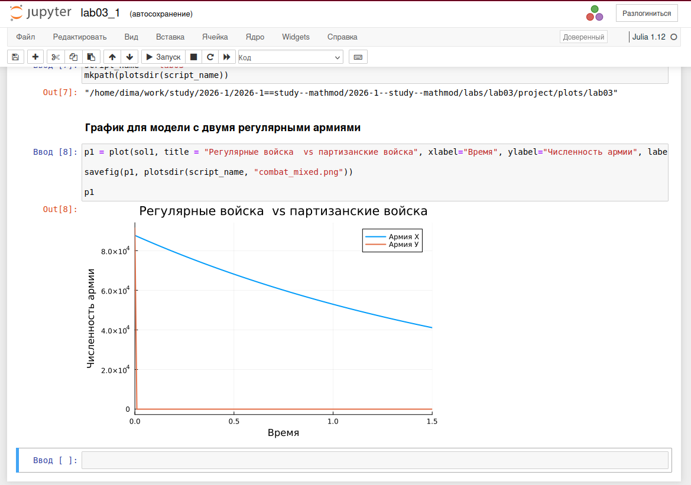

---
## Author
author:
  name: Стрижов Дмитрий Павлович
  degrees: student
  orcid: 0000-0002-0877-7063
  email: 1132236054@rudn.ru
  affiliation:
    - name: Российский университет дружбы народов
      country: Российская Федерация
      postal-code: 117198
      city: Москва
      address: ул. Миклухо-Маклая, д. 6
## Title
title: "Отчет по лабораторной работе №2"
subtitle: "Задача о погоне"
license: "CC BY"
---

# Цель работы

Целью данной лабораторной работы является построение математической модели боевых действий.

# Задание

- Создать скрипт для построения математической модели боевых действий (для двух случаев) 
- Выполнить jupyter notebook 
- Встроить скрипт в отчет

# Выполнение лабораторной работы

Создаем структуру проекта и устанавливаем необходимые пакеты ([рис. @fig-001]).

{#fig-001 width=70%}

Пишем скрипт математической и запускаем jupyter notebook ([рис. @fig-002]).

{#fig-002 width=70%}

Пишем скрипт математической и запускаем jupyter notebook (для второго скрипта) ([рис. @fig-003]).

{#fig-003 width=70%}

# Задание 1



# Задание 2



# Выводы

Была выполнена основная цель - построение математической модели боевых действий.

