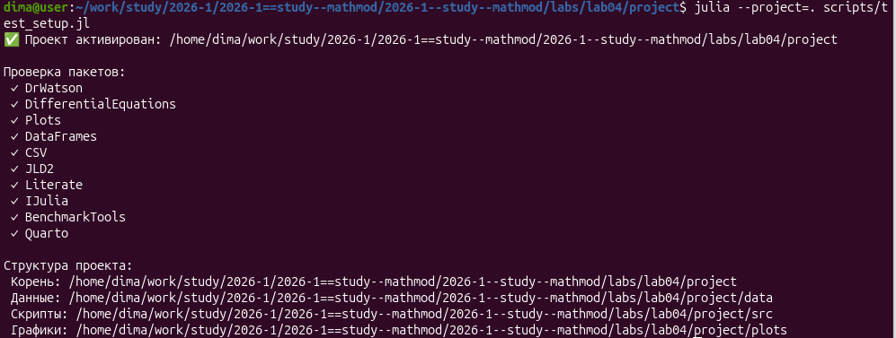
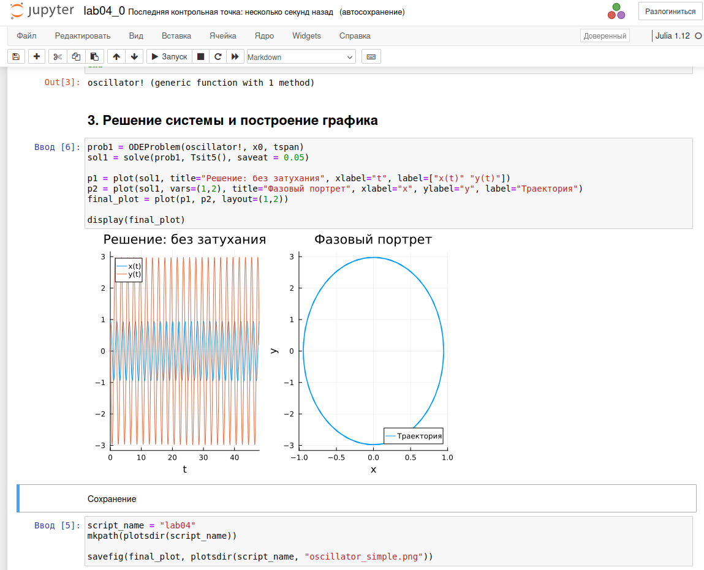
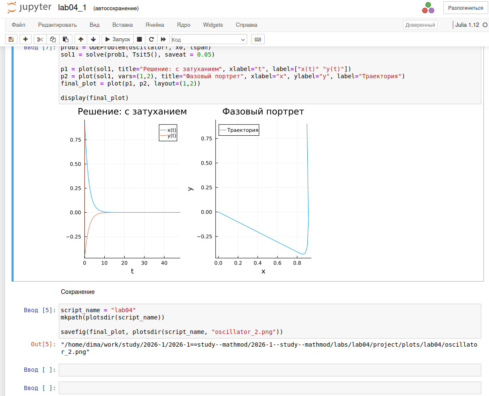
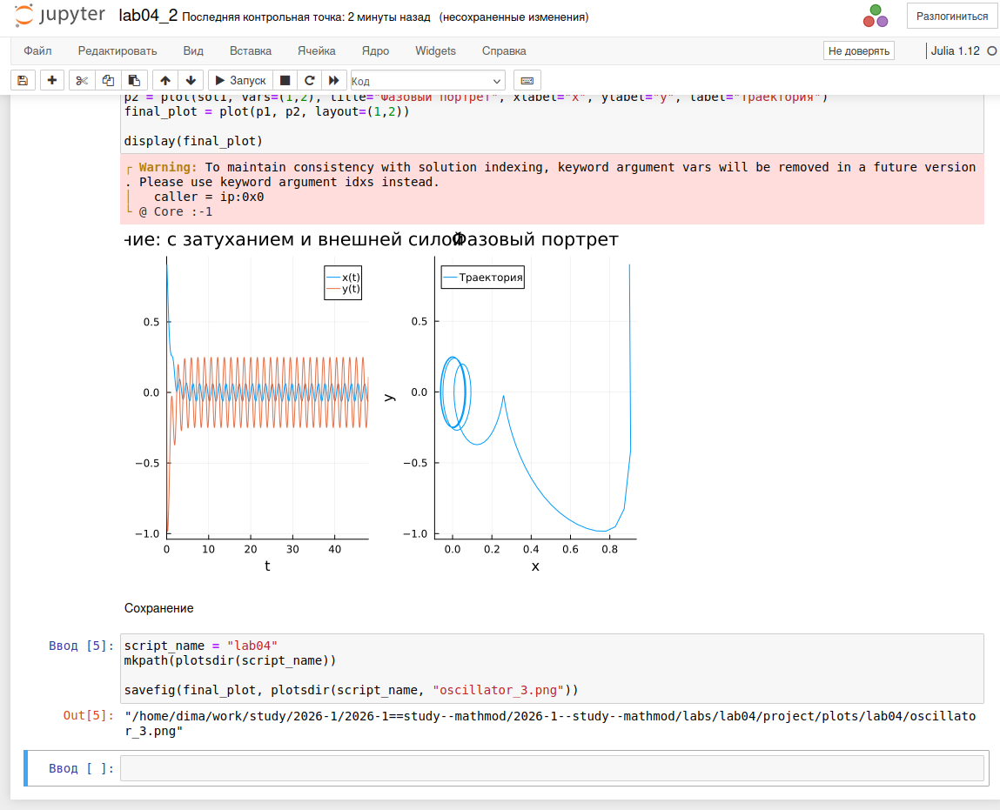

---
## Author
author:
  name: Стрижов Дмитрий Павлович
  degrees: student
  orcid: 0000-0002-0877-7063
  email: 1132236054@rudn.ru
  affiliation:
    - name: Российский университет дружбы народов
      country: Российская Федерация
      postal-code: 117198
      city: Москва
      address: ул. Миклухо-Маклая, д. 6
      
## Title
title: "Отчет по лабораторной работе №4"
subtitle: "Модель гармонических колебаний"
license: CC BY
date: today
date-format: "2026-09-12" # Example: 2025-09-06
---

# Информация

## Докладчик

:::::::::::::: {.columns align=center}
::: {.column width="70%"}

  * Стрижов Дмитрий Павлович
  * студент Факультета физико-математических и естественных наук
  * Российский университет дружбы народов им. П. Лумумбы
  * [1132236054@rudn.ru](mailto:1132236054@rudn.ru)

:::
::: {.column width="30%"}

:::
::::::::::::::

# Вводная часть

## Цель работы

Целью данной лабораторной работы является построение математической модели гармонических колебаний.

## Задание

- Создать скрипт для построения математической модели гармонических колебаний
- Выполнить jupyter notebook 
- Встроить скрипт в отчет

## Выполнение лабораторной работы

Создаем структуру проекта и устанавливаем необходимые пакеты ([рис. @fig-001]).

{#fig-001 width=70%}

## Выполнение лабораторной работы

Пишем скрипт математической и запускаем jupyter notebook ([рис. @fig-002]).

{#fig-002 width=70%}

## Выполнение лабораторной работы

Пишем скрипт математической и запускаем jupyter notebook (для второго скрипта) ([рис. @fig-003]).

{#fig-003 width=70%}

## Выполнение лабораторной работы

Пишем скрипт математической и запускаем jupyter notebook (для третьего скрипта) ([рис. @fig-004]).

{#fig-004 width=70%}

# Выводы

Была выполнена основная цель - построение математической модели гармонических колебаний.

