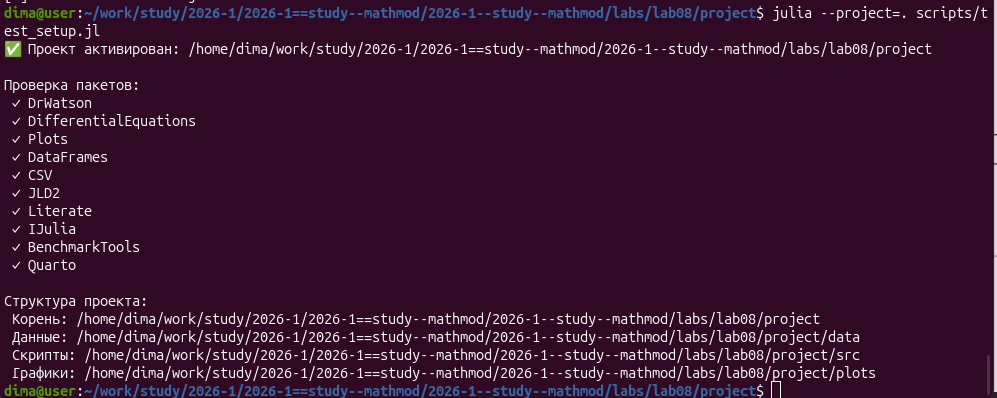
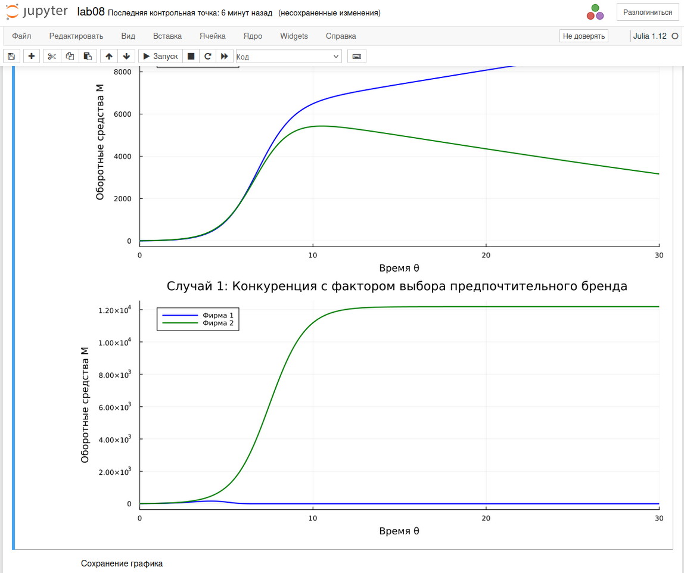

---
## Author
author:
  name: Стрижов Дмитрий Павлович
  degrees: student
  orcid: 0000-0002-0877-7063
  email: 1132236054@rudn.ru
  affiliation:
    - name: Российский университет дружбы народов
      country: Российская Федерация
      postal-code: 117198
      city: Москва
      address: ул. Миклухо-Маклая, д. 6
## Title
title: "Отчет по лабораторной работе №8"
subtitle: "Модель конкуренции двух фирм"
license: "CC BY"
---
# Цель работы

Целью данной лабораторной работы является построение математической модели конкуренции двух фирм.

# Задание

- Создать скрипт для построения математической модели конкуренции двух фирм
- Выполнить jupyter notebook 
- Встроить скрипт в отчет

# Выполнение лабораторной работы

Создаем структуру проекта и устанавливаем необходимые пакеты ([рис. @fig-001]).

{#fig-001 width=70%}

Пишем скрипт математической модели и запускаем jupyter notebook ([рис. @fig-002]).

{#fig-002 width=70%}

# Задание 1



# Выводы

Была выполнена основная цель - построение математической модели конкуренции двух фирм.

